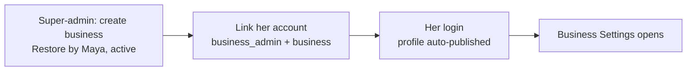
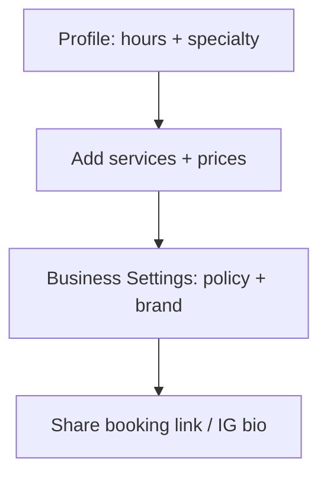
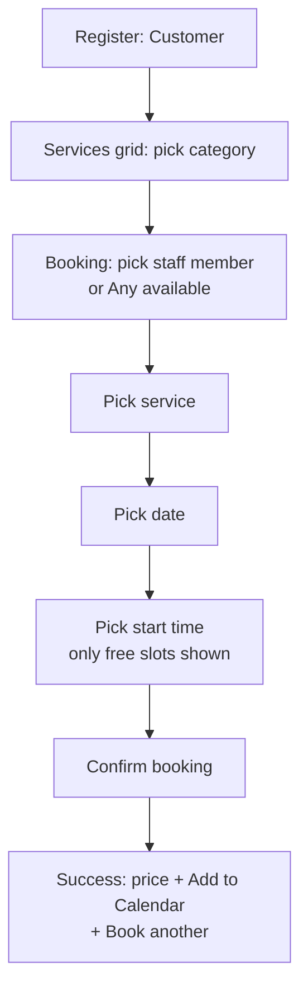

# RestoraHub — User Manual (Restore by Maya pilot)

> Who is who: **Owner** (runs the business in the app), **Staff/Professional**
> (takes bookings), **Customer** (books), **Super-admin** (technical setup only).
> In this pilot the owner *is* the professional: one account with the
> `business_admin` role on the **Restore by Maya** business.

## 0. One-time setup (owner-assisted, ~10 minutes)

You only do this once. Nothing here needs code.

1. **Become super-admin.** Firebase console → Firestore → `users` →
   your login document → set `role` to `super_admin`. Log out, log back in.
2. **Create the business.** Drawer → Super Admin Dashboard → Businesses →
   Add Business. Name: **Restore by Maya**, type wellness, owner email = her
   login email. Set status to **active** (active skips the setup wizard).
3. **Link her account.** Same dashboard → Users → her account → Edit →
   role **`business_admin`**, business **Restore by Maya**. Save.
4. **Verify as her.** She logs out and back in (this also publishes her
   public booking profile). She opens Business Settings — it must open
   with no wizard and no errors.

## 1. Her setup (in the app, by her)

1. **Profile** (drawer → Edit profile): name, phone, specialty (e.g. Massage),
   work start/end, slot length (e.g. 60 min), buffer/breaks. Save.
2. **Services** (Profile → My Offered Services → Add, or Services Catalog):
   name, duration, price. Her specialty is attached automatically.
3. **Policy** (drawer → Business Settings → Booking Policy, admin only):
   cancellation cutoff (2/12/24/48h), deposit toggle + percent, no-show fee.
4. **Brand** (same page): primary color swatches or hex, logo URL.

## 2. Taking bookings (her daily loop)

- **Dashboard** (Professional home): Upcoming tab = new `pending` requests →
  **Accept** or **Decline**. Past tab = history (read-only actions except below).
- **Manual booking** (+ button): for walk-ins and phone calls. Pick customer
  (or register them first — the picker cannot create accounts), service,
  date, time. Same availability rules as online booking.
- **Reschedule**: any upcoming card → Reschedule → new slot (conflicts blocked).
- **Cancel**: customer side up to the cutoff (default 2h); professional side
  from the card. Inside the cutoff the app refuses with the reason shown.
- **No-show**: past, non-cancelled cards offer **Mark as no-show**. If a
  no-show fee is configured, a *pending* fee payment is created automatically.
- **Record payment**: completed cards without payment offer **Record payment**
  → amount (deposit prefilled from policy) → method → done. The appointment
  flips to completed and a receipt exists.
- **Earnings** (drawer → Earnings): last-30-days revenue, per-payment list,
  shareable report. Receipts open from here.

## 3. Customer journey

- Registration locks the account type; first login may ask to complete name/phone.
- **Any available** auto-assigns the first free professional.
- Fully booked days say so; the Confirm button always states what is missing.
- Past appointments page: history, reschedule, cancel (within policy).
- Notifications (bell + badge): requests, confirmations, cancellations, reminders.
- **If the professional list fails to load**, an error with **Retry** appears —
  screenshot it and send it to support. Re-login also refreshes the directory.

## 4. Rules customers feel (defaults)

| Rule | Default | Where set |
|---|---|---|
| Cancel cutoff | 2h before start | Business Settings → Booking Policy |
| Deposit | off | Same page (percent of price) |
| No-show fee | off | Same page (flat amount) |
| Reminders | in-app + badge; native calendar via Add to Calendar | automatic |

## 5. Troubleshooting

| Symptom | Cause | Fix |
|---|---|---|
| Customer sees no professionals | Query error (tap Retry; screenshot any red text) or staffer never logged in after setup | Retry; staffer re-login republishes profile |
| "Services coming soon" with staff listed | No services created yet, or none assigned to that pro | Pro adds services in Profile |
| Confirm button dead, no message | Should not happen — every blocker names itself | Screenshot + report |
| Payment recorded but appointment not completed | Link step interrupted | Open the appointment → Record payment again |
| Blank Setup Wizard | Account has no business linked | Super-admin links business (see §0) |
| Wrong price on receipt | Service price edited after booking | Receipt freezes the recorded payment; edit the service for future bookings |

## 6. What is deliberately NOT in the pilot

Online card collection, SMS/email blasts, team invites by owners, second
businesses, custom domains, marketplace discovery. These are roadmap items
(ROADMAP.md Phases 2–4), gated until the pilot earns them. If anyone asks:
"No" is the current answer — complaints become prioritized work, not scope.
