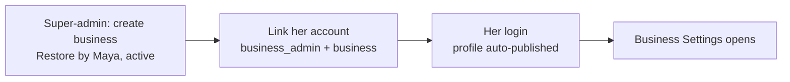
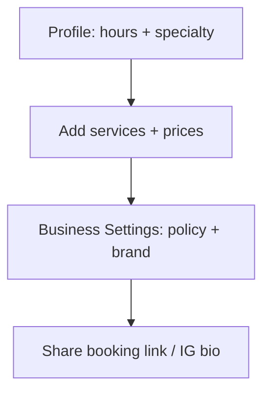
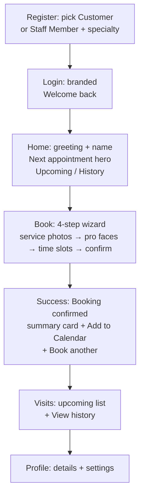

# RestoraHub — User Manual (Restore by Maya pilot)

> Who is who: **Owner** (Maya — runs the business in the app),
> **Staff** (takes bookings), **Customer** (books),
> **Super-admin** (technical setup only).
> In this pilot the owner *is* the one staff member: one account with the
> `business_admin` role on the **Restore by Maya** business.
>
> Customers never see business-picking or setup screens. They register,
> land on their Home dashboard, and book — the business is already chosen
> for them (their account carries it).

## 0. One-time setup (owner-assisted, ~10 minutes)

You only do this once. Nothing here needs code.

1. **Become super-admin.** Firebase console → Firestore → `users` →
   your login document → set `role` to `super_admin`. Log out, log back in.
2. **Create the business.** Super Admin Dashboard → Businesses →
   Add Business. Name: **Restore by Maya**, type wellness, owner email = her
   login email. Set status to **active** (active skips the setup wizard).
3. **Link her account.** Same dashboard → Users → her account → Edit →
   role **`business_admin`**, business **Restore by Maya**. Save.
4. **Verify as her.** She logs out and back in (this also publishes her
   public booking profile). She opens Business Settings — it must open
   with no wizard and no errors.

```mermaid
flowchart LR
    A[Super-admin: create business\nRestore by Maya, active] --> B[Link her account\nbusiness_admin + business]
    B --> C[Her login\nprofile auto-published]
    C --> D[Business Settings opens]
```

## 1. Her setup (in the app, by her)

1. **Profile** (Edit profile): name, phone, specialty (e.g. Massage),
   work start/end, slot length (e.g. 60 min), buffer/breaks. Save.
2. **Services** (Profile → My Offered Services → Add, or Services Catalog):
   name, duration, price. Her specialty is attached automatically.
3. **Policy** (Business Settings → Booking Policy, admin only):
   Cancellation cutoff dropdown (2/12/24/48h), deposit toggle + percent,
   no-show fee.
4. **Brand** (same page → Branding & Appearance): tap a preset swatch or
   type a hex into **Primary Color Hex** (e.g. `#2F5D50`), paste a
   **Logo URL** (a live preview appears under the field). Save — the whole
   app re-themes from these values.
   Alternative for developers: edit `assets/brand/maya.json` (see §6,
   Brand tweaks) — same values, kept in git as the brand record.

```mermaid
flowchart TD
    P[Profile: hours + specialty] --> S[Add services + prices]
    S --> Q[Business Settings: policy + brand]
    Q --> R[Share booking link / IG bio]
```

## 2. Taking bookings (her daily loop)

- **Manage bookings** (staff home): three tabs — **Upcoming** (new `pending`
  requests → **Accept** or **Decline**), **Past** (history), **Calendar**
  (month view of her book).
- **Manual booking** (**Create Manual Booking** button): for walk-ins and
  phone calls. Search and pick the customer (register them first if they
  have no account — the picker cannot create accounts), then service,
  date, time. Same availability rules as online booking.
- **Reschedule**: any upcoming card → **Reschedule** → new slot (conflicts
  blocked). Rescheduling keeps the customer on the same booking, moved.
- **Cancel**: customers can cancel up to the cutoff (default 2h); she can
  cancel or decline from the card. Inside the cutoff the app refuses and
  says why.
- **No-show**: past, non-cancelled cards offer **Mark as no-show**. If a
  no-show fee is configured, a *pending* fee payment is created
  automatically.
- **Record payment**: completed cards without payment offer
  **Record payment** → amount (deposit prefilled from policy) → method →
  done. The appointment flips to completed and a receipt exists.
- **Earnings** (drawer → Earnings): revenue totals, per-payment list,
  shareable report. Receipts open from here.

## 3. Customer journey

After login a customer lands on their **Home dashboard**. The same pages
are also grouped as bottom tabs — **Home**, **Book**, **Visits**,
**Profile** — so everywhere below is one tap away.

```mermaid
flowchart TD
    R[Register: pick Customer\nor Staff Member + specialty] --> L[Login: branded\nWelcome back]
    L --> H[Home: greeting + name\nNext appointment hero\nUpcoming / History]
    H --> B[Book: 4-step wizard\nservice photos → pro faces → time slots → confirm]
    B --> OK[Success: Booking confirmed\nsummary card + Add to Calendar\n+ Book another]
    OK --> V[Visits: upcoming list\n+ View history]
    V --> P[Profile: details + settings]
```

- **Install → register → login.** Registration asks for name, email, phone,
  password and **Account type** (Customer, or Staff Member + Specialty).
  The choice locks the account type — pick carefully. Login shows the
  salon's branded header (logo or initial, business name) over a
  **Welcome back** / **Sign in to manage your bookings** card, with Email,
  Password and **Forgot password?**.
- **Home.** A greeting matching the time of day (Good morning / Good
  afternoon / Good evening), her first name in big type, then
  **Upcoming** / **History** tabs. The next visit gets a hero card —
  photo, **Next appointment** label, service, date and pro — with
  **Reschedule** and **Cancel** right on it. An empty Upcoming tab says
  **No upcoming visits** / **Ready for your next visit?** with a
  **Book Now** button.
- **Book (4-step wizard).** A progress bar tracks the four steps:
  1. **Service** — a photo grid (massage, facial, nails, hair and more each
     have their own picture). Tapping one advances the wizard.
  2. **Pro** — staff faces with names and specialties, plus
     **Any available** (auto-assigns the first free professional).
  3. **Time** — pick a **Date**, then tap a free start slot. Only genuinely
     free slots are shown; fully booked days say
     *Fully booked for this day — pick another date*. The chosen range is
     echoed back with its duration.
  4. **Confirm** — service summary (duration, price), who and when, a
     deposit-due notice if the salon requires one, then
     **Confirm booking** (with a light haptic tap on success).
  A **Next** button walks steps 1–3 forward; whenever it is disabled, the
  line under it always states exactly what is missing
  (e.g. *Select a staff member to continue*).
- **Success.** No bare checkmark: a **Booking confirmed** pill, a
  **See you soon** headline, a summary card (service, price, pro,
  date/time), then **Add to Calendar** (writes to the phone's native
  calendar), **Book another** and **Back to dashboard**.
- **Visits.** The upcoming list; a **View history** link at the bottom
  opens past appointments (reschedule/cancel follow the same policy).
- **Profile.** Account details, app settings, logout. Logging out returns
  to the login screen — that is expected, not an error.
- **Notifications** (bell + badge): requests, confirmations, cancellations,
  reminders.
- **If the staff list fails to load**, an error with **Retry** appears —
  screenshot it and send it to support. Re-login also refreshes the
  directory.

## 4. Rules customers feel (defaults)

| Rule | Default | Where set |
|---|---|---|
| Cancel cutoff | 2h before start | Business Settings → Booking Policy |
| Deposit | off | Same page (percent of price) |
| No-show fee | off | Same page (flat amount) |
| Reminders | in-app + badge; native calendar via Add to Calendar | automatic |

## 5. Troubleshooting

| Symptom | Cause | Fix |
|---|---|---|
| Customer sees no staff | Load error (tap Retry; screenshot any red text) or staffer never logged in after setup | Retry; staffer re-login republishes profile |
| "Services coming soon" with staff listed | No services created yet, or none assigned to that pro | Pro adds services in Profile |
| Confirm button dead | Never silent — the line under it names the missing piece | Follow what it says (pick pro, date, or time) |
| Payment recorded but appointment not completed | Link step interrupted | Open the appointment → Record payment again |
| Blank Setup Wizard | Account has no business linked | Super-admin links business (see §0) |
| Wrong price on receipt | Service price edited after booking | Receipt freezes the recorded payment; edit the service for future bookings |
| I see initials instead of photos | No photo uploaded yet (logo spots show the business initial) or an image failed to load (service/staff fall back to a monogram tile) | Upload a logo URL in Branding; for stock photos see §6; otherwise retry on good network |
| App opens to login after logout | Expected — logout always returns to login | Log back in |
| Odd colors or hard-to-read text in dark mode | The app renders the owner's saved theme in both light and dark | Screenshot it and report which screen + light/dark; the owner can adjust the primary color in Branding |

## 6. Brand tweaks (`assets/brand/maya.json`)

The file is the committed brand record for RESTORE by MAYA. It ships with
the app (bundled asset), is tracked in git, and every field is optional:
a missing or misspelled field quietly falls back to its default — the app
never crashes on a bad brand file.

> Runtime note: in this build the running app's colors and logo come from
> Business Settings → Branding & Appearance (saved to the business
> document, applied instantly). Keep the two in sync: change the look in
> Business Settings, then mirror the values into `maya.json` so the next
> fresh install and every git checkout carry the same brand.

| Key | Effect | Default |
|---|---|---|
| `businessId` | Reserved link to the Firestore business (null = no link; app follows the normal login path) | `null` |
| `displayName` | Salon name on branded headers | `"RestoraHub"` |
| `tagline` | Brand tagline record (login/register headers currently show the business address line) | `"Beauty & wellness bookings"` |
| `seedColor` | Primary theme color (hex `#RRGGBB`); drives buttons, tabs, selected states | `"#2F5D50"` (deep spa green) |
| `displayFont` | Headline font (big greetings, titles) | `"Fraunces"` |
| `bodyFont` | Body font (buttons, labels, lists) | `"Inter"` |
| `address` | Salon address line (shown under the name on branded headers) | none (null) |
| `phone` | Salon phone record | none (null) |
| `hours` | Opening-hours record | none (null) |
| `photoOverrides` | Reserved map of catalog key → image URL for remote photo swaps | `{}` (empty) |

Current MAYA values: name **Restore by Maya**, seed `#2F5D50`, Fraunces +
Inter, address **Main St 12**, phone/hours unset, no overrides.

**Change → verify flow (colors, logo, text):**

1. Change the look in the app first: Business Settings → Branding &
   Appearance → swatch or **Primary Color Hex**, **Logo URL** → Save.
2. Mirror into `assets/brand/maya.json` (same hex, same URL, updated name
   or address) so git keeps the brand.
3. Hot restart (`R` in `flutter run`) to reload bundled assets, then open
   the app and check: login header, Home greeting, a Book wizard step, and
   the success screen — all four should wear the new color.
4. `git diff` should show only `maya.json` (plus Firestore holds the live
   values). Commit the file — it is the backup if the business document is
   ever reset. Precedence rule: when the business has branding saved in
   Firestore (Business Settings), that wins; on a fresh install with no
   saved branding, the app reads `maya.json` instead.

**Photo replacement (works today, no code):** service and staff pictures
come from `assets/images/stock/`, picked by name-matching:

| Photo file | Used for |
|---|---|
| `massage-deep-tissue.jpg` | massage / stone services |
| `facial-hydra.jpg` | facial / skin / peel services |
| `nails-gel.jpg` | nail / manicure / pedicure services |
| `hair-stylist-work.jpg` | hair / cut / color / balayage services |
| `aromatherapy-oils.jpg` | aroma / oil services |
| `hero-spa-still-life.jpg` | everything else + the next-visit hero |
| `staff-elena.jpg`, `staff-sofia.jpg`, `staff-ana.jpg` | staff avatars, cycled in order |

To swap a photo: replace the file **keeping the exact filename**, rebuild
the app, and check the matching wizard step. (`photoOverrides` in `maya.json` takes precedence when set: put a remote image URL under the service name in lowercase, `hero`, or `staff0/1/2`. Empty map (default) keeps the bundled files.)

## 7. What is deliberately NOT in the pilot

Online card collection, SMS/email blasts, team invites by owners, second
businesses, custom domains, marketplace discovery, and a reskin of the
staff/admin screens (Manage bookings, Business Settings, Earnings and
friends still wear the classic layout under the new brand color). These
are roadmap items, gated until the pilot earns them. If anyone asks:
"No" is the current answer — complaints become prioritized work, not
scope.
